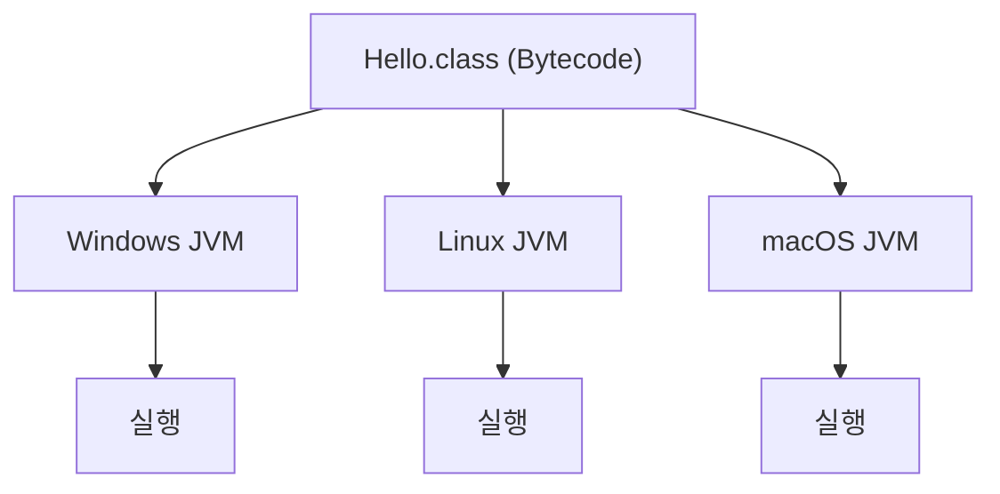

# Java 실행 과정

## 1. 전체 실행 흐름

Java 프로그램은 작성한 소스 코드를 CPU가 바로 실행하는 것이 아니라, 먼저 **Bytecode로 컴파일한 뒤 JVM이 실행**합니다.

```text
.java
 ↓
javac
 ↓
.class
 ↓
Bytecode
 ↓
JVM
 ├─ Class Loader
 ├─ Runtime Data Area
 └─ Execution Engine
       ├─ Interpreter
       └─ JIT
 ↓
실행
```

## 2. Java 소스 코드와 컴파일

개발자가 작성하는 Java 소스 코드는 `.java` 확장자를 가집니다.

```java
public class Hello {
    public static void main(String[] args) {
        // 화면에 문자열을 출력한다.
        System.out.println("Hello");
    }
}
```

Java Compiler인 `javac`로 소스 코드를 컴파일합니다.

```bash
javac Hello.java
```

컴파일이 완료되면 다음과 같이 `.class` 파일이 생성됩니다.

```text
Hello.java
   ↓ javac
Hello.class
```

## 3. Bytecode

`.class` 파일에는 CPU가 직접 실행하는 기계어가 아니라 **JVM이 이해할 수 있는 Bytecode**가 들어 있습니다.

즉, Java는 소스 코드를 바로 특정 운영체제의 기계어로 변환하지 않고 JVM에서 실행할 수 있는 중간 코드인 Bytecode로 변환합니다.

## 4. JVM과 플랫폼 독립성

동일한 Bytecode를 각 운영체제에 맞는 JVM에서 실행할 수 있습니다.



따라서 Java는 **Write Once, Run Anywhere**라는 특징을 가집니다.

정확히는 Bytecode가 플랫폼에 독립적이고, **JVM 자체는 운영체제와 플랫폼에 맞는 구현이 필요합니다.**

## 5. JVM 내부에서의 실행

JVM은 크게 다음 구성 요소를 통해 Bytecode를 실행합니다.

```text
.class
   ↓
Class Loader
   │
   │ 클래스 로딩
   ↓
Runtime Data Area
   │
   │ 실행에 필요한 데이터 저장
   ↓
Execution Engine
   │
   ├─ Interpreter
   └─ JIT Compiler
   ↓
실행
```

### Class Loader

`.class` 파일의 Bytecode를 JVM 내부로 로딩합니다.

### Runtime Data Area

JVM이 프로그램을 실행하면서 사용하는 메모리 영역입니다. 이후 학습할 Stack, Heap 등이 여기에 포함됩니다.

### Execution Engine

Runtime Data Area에 배치된 Bytecode를 실제로 실행합니다.

주요 실행 방식에는 다음 두 가지가 있습니다.

- **Interpreter**: Bytecode 명령을 해석하면서 실행
- **JIT Compiler**: 반복적으로 실행되는 Bytecode 등을 Native Code로 컴파일하여 실행 성능을 높임

각 구성 요소의 상세한 동작은 이후 JVM 구조에서 학습합니다.

## 6. 전체 과정 정리

```text
Java Source Code (.java)
        ↓
Java Compiler (javac)
        ↓
Bytecode (.class)
        ↓
JVM
        ↓
Class Loader
        ↓
Runtime Data Area
        ↓
Execution Engine
   ├─ Interpreter
   └─ JIT Compiler
        ↓
프로그램 실행
```

## 7. 면접 질문

### Q. Java 코드가 실행되는 과정을 설명해주세요.

Java 소스 코드인 `.java` 파일은 Java Compiler인 `javac`에 의해 JVM이 이해할 수 있는 Bytecode인 `.class` 파일로 컴파일됩니다.

이후 JVM의 Class Loader가 클래스 파일을 로딩하고, 실행에 필요한 정보가 Runtime Data Area에 배치됩니다. Execution Engine은 Bytecode를 Interpreter와 JIT Compiler 등을 통해 실행합니다.

Java는 Bytecode를 JVM 위에서 실행하기 때문에 각 플랫폼에 맞는 JVM이 있다면 동일한 Bytecode를 여러 플랫폼에서 실행할 수 있습니다.

## 핵심 정리

- `.java`는 개발자가 작성하는 Java 소스 파일이다.
- `javac`는 Java 소스 코드를 Bytecode로 컴파일한다.
- `.class` 파일에는 JVM이 이해할 수 있는 Bytecode가 들어 있다.
- Class Loader는 클래스를 JVM으로 로딩한다.
- Runtime Data Area는 프로그램 실행에 필요한 메모리 영역이다.
- Execution Engine은 Bytecode를 실행한다.
- Interpreter와 JIT Compiler가 Bytecode 실행에 사용된다.
- Bytecode는 플랫폼에 독립적이지만 JVM 구현은 플랫폼에 따라 다르다.
