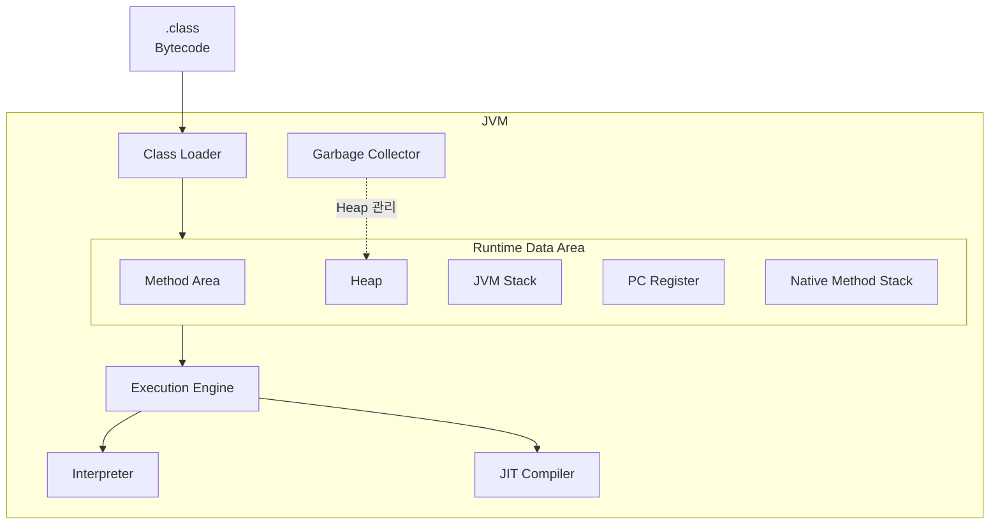
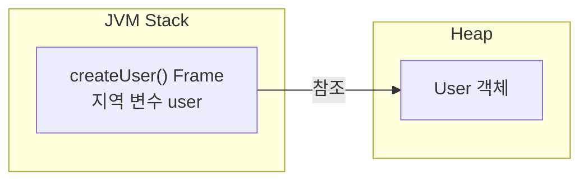
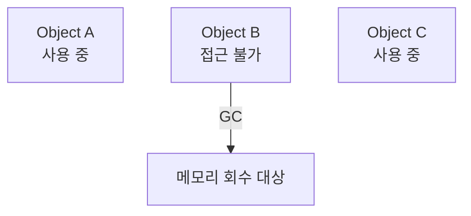

# JVM 구조

JVM(Java Virtual Machine)은 **Java Bytecode를 실행하기 위한 가상 머신**입니다.

이전 학습에서 살펴본 Java 실행 과정 중 JVM 내부를 조금 더 자세히 살펴봅니다.

```text
.java
 ↓
javac
 ↓
.class
 ↓
JVM
 ├─ Class Loader
 ├─ Runtime Data Area
 └─ Execution Engine
```

## 1. JVM의 전체 구조

JVM은 실행 흐름을 기준으로 **Class Loader, Runtime Data Area, Execution Engine**으로 나누어 이해할 수 있습니다. GC도 JVM 내부의 구성 요소로서 Heap의 메모리를 관리합니다.



GC는 JVM 내부에서 동작하지만, Bytecode를 해석하거나 컴파일하는 Interpreter·JIT와는 역할이 다릅니다. 개념도에 따라 Execution Engine의 관련 기능으로 함께 표시하기도 하며, 위 그림에서는 **Heap을 관리하는 역할**을 분명히 보여주기 위해 별도로 배치했습니다.

## 2. Class Loader

Class Loader는 컴파일을 통해 만들어진 `.class` 파일의 **Bytecode를 JVM 내부로 로딩**합니다.

```text
Hello.class
     ↓
Class Loader
     ↓
JVM 내부에 클래스 정보 로딩
```

클래스 로딩 과정은 크게 다음과 같이 이어집니다.

```text
Loading
  ↓
Linking
  ↓
Initialization
```

각 단계의 자세한 동작은 이후 `Class Loader`에서 학습합니다.

## 3. Runtime Data Area

Runtime Data Area는 **JVM이 프로그램을 실행하면서 사용하는 메모리 영역**입니다.

```text
Runtime Data Area

├─ Method Area
├─ Heap
├─ JVM Stack
├─ PC Register
└─ Native Method Stack
```

### Method Area

클래스와 관련된 메타데이터, 메서드 정보 등 프로그램 실행에 필요한 클래스 수준의 정보를 저장하는 영역입니다.

### Heap

`new` 등을 통해 생성되는 **객체가 저장되는 영역**입니다.

### JVM Stack

메서드가 호출될 때 생성되는 Stack Frame이 저장되는 영역입니다.

지역 변수, 연산 과정에서 사용하는 값 등이 Stack Frame에 포함됩니다.

예를 들어 다음 코드가 있다고 가정합니다.

```java
public void createUser() {
    // Heap에 생성된 User 객체를 지역 변수 user가 참조한다.
    User user = new User();
}
```

개념적으로 다음과 같이 생각할 수 있습니다.



Heap과 Stack의 상세한 차이는 다음 학습 주제에서 다룹니다.

### PC Register

각 Thread가 현재 실행하고 있는 JVM 명령의 위치를 관리하기 위한 영역입니다.

### Native Method Stack

Java가 아닌 Native Code를 실행할 때 사용하는 Stack 영역입니다.

## 4. Execution Engine

Execution Engine은 Runtime Data Area에 준비된 **Bytecode를 실제로 실행**합니다.

```text
Bytecode
   ↓
Execution Engine
   │
   ├─ Interpreter
   └─ JIT Compiler
   ↓
Native Code
   ↓
CPU 실행
```

### Interpreter

Bytecode 명령을 해석하면서 실행합니다.

바로 실행할 수 있지만 동일한 코드를 계속 해석해야 한다면 비효율적일 수 있습니다.

### JIT Compiler

반복적으로 실행되는 코드 등을 Native Code로 컴파일하여 이후 더 빠르게 실행할 수 있도록 합니다.

JIT Compiler의 자세한 동작은 이후 별도의 주제에서 학습합니다.

## 5. Garbage Collector

Garbage Collector(GC)는 Heap 영역에서 **더 이상 참조되지 않는 객체를 찾아 메모리를 회수**합니다.



GC의 동작 원리는 이후 `GC(Garbage Collection)`에서 자세히 학습합니다.

## 6. JVM 실행 흐름 정리

```text
.class (Bytecode)
        ↓
Class Loader
        ↓
Runtime Data Area
 ├─ Method Area
 ├─ Heap
 ├─ JVM Stack
 ├─ PC Register
 └─ Native Method Stack
        ↓
Execution Engine
 ├─ Interpreter
 ├─ JIT Compiler
        ↓
프로그램 실행
```

GC는 이 실행 흐름과 별개로 JVM 내부에서 Heap의 메모리를 관리합니다.

## 7. 면접 질문

### Q. JVM의 구조에 대해 설명해주세요.

JVM은 크게 Class Loader, Runtime Data Area, Execution Engine으로 볼 수 있습니다.

Class Loader는 컴파일된 `.class` 파일의 Bytecode를 JVM으로 로딩합니다. Runtime Data Area는 프로그램 실행에 사용하는 메모리 영역으로 Method Area, Heap, JVM Stack, PC Register, Native Method Stack 등으로 구성됩니다.

Execution Engine은 로딩된 Bytecode를 Interpreter와 JIT Compiler 등을 이용해 실행하며, JVM은 Garbage Collector를 통해 Heap에서 더 이상 사용되지 않는 객체의 메모리도 관리합니다.

## 핵심 정리

- **Class Loader**: `.class`의 Bytecode를 JVM으로 로딩한다.
- **Runtime Data Area**: JVM이 프로그램을 실행하면서 사용하는 메모리 영역이다.
- **Heap**: 객체가 저장된다.
- **JVM Stack**: 메서드 호출과 지역 변수 등에 필요한 Stack Frame이 저장된다.
- **PC Register**: 각 Thread가 실행 중인 JVM 명령의 위치를 관리한다.
- **Native Method Stack**: Native Code 실행에 사용된다.
- **Execution Engine**: Bytecode를 실행한다.
- **Interpreter**: Bytecode를 해석하며 실행한다.
- **JIT Compiler**: Bytecode 일부를 Native Code로 컴파일해 실행 성능을 높인다.
- **GC**: Heap에서 더 이상 참조되지 않는 객체의 메모리를 회수한다.

다음 학습 주제에서는 Runtime Data Area 중 특히 중요한 **Stack과 Heap**을 자세히 살펴봅니다.
