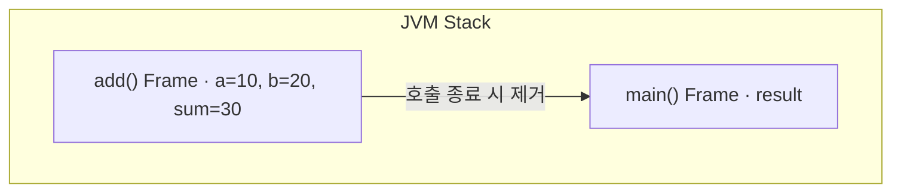
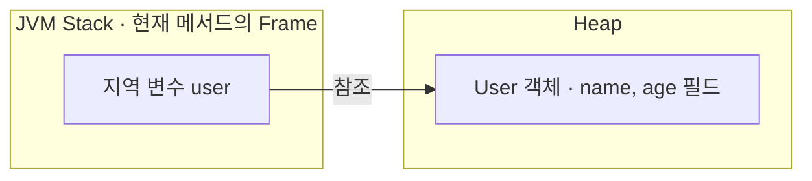
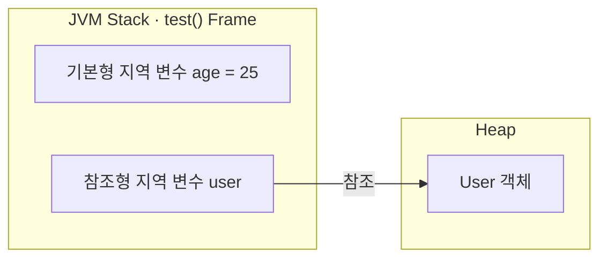
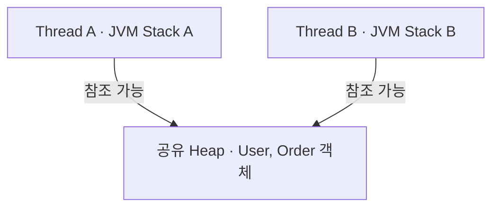
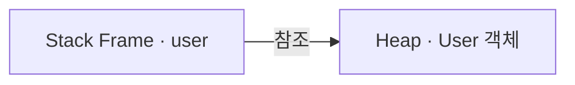
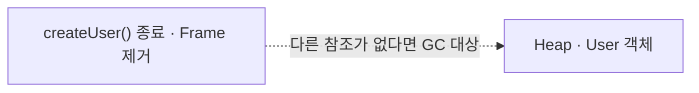
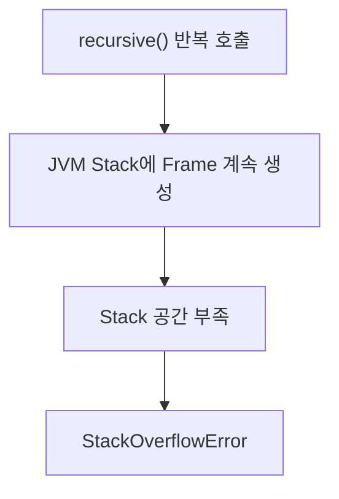

# Stack과 Heap

JVM의 Runtime Data Area 중 **JVM Stack과 Heap**을 학습합니다.

```text
Runtime Data Area

├─ Method Area
├─ Heap              ← 핵심
├─ JVM Stack         ← 핵심
├─ PC Register
└─ Native Method Stack
```

가장 먼저 기억할 핵심은 다음과 같습니다.

> **Stack은 메서드 실행 단위로 사용되고, Heap은 객체가 저장되는 공간입니다.**

## 1. JVM Stack

JVM Stack은 **메서드가 호출될 때 필요한 데이터를 저장하는 메모리 영역**입니다.

메서드가 호출될 때마다 Stack Frame이 생성되고, 메서드가 종료되면 해당 Stack Frame이 제거됩니다.

```java
public class Main {

    public static void main(String[] args) {
        int result = add(10, 20);
    }

    private static int add(int a, int b) {
        int sum = a + b;
        return sum;
    }
}
```

`add()`가 호출되면 개념적으로 다음과 같이 Stack Frame이 쌓입니다.



`add()`가 종료되면 `add()`의 Stack Frame이 제거됩니다.

```text
메서드 호출
    ↓
Stack Frame 생성
    ↓
메서드 실행
    ↓
메서드 종료
    ↓
Stack Frame 제거
```

## 2. Stack Frame

Stack Frame에는 대표적으로 다음과 같은 정보가 포함됩니다.

```text
Stack Frame

├─ Local Variables
├─ Operand Stack
└─ 기타 메서드 실행 정보
```

### Local Variables

메서드의 매개변수와 지역 변수 등이 저장됩니다.

```java
private static int add(int a, int b) {
    int sum = a + b;
    return sum;
}
```

위 코드에서는 `a`, `b`, `sum` 등이 Local Variables와 관련됩니다.

### Operand Stack

Bytecode가 연산을 수행할 때 사용하는 작업 공간입니다.

예를 들어 `a + b`와 같은 연산을 수행할 때 필요한 값들을 Operand Stack에 올려 계산합니다.

## 3. Heap

Heap은 **객체와 배열 등이 생성되는 메모리 영역**입니다.

대표적으로 `new`를 사용해 객체를 생성하면 객체는 Heap에 생성됩니다.

```java
User user = new User();
```

개념적으로 보면 지역 변수 `user`는 현재 메서드의 Stack Frame에 존재하고, Heap에 생성된 `User` 객체를 참조합니다.



## 4. 기본형과 객체 참조

```java
public void test() {
    // 기본형 지역 변수
    int age = 25;

    // 참조형 지역 변수
    User user = new User();
}
```

개념적으로 다음과 같이 볼 수 있습니다.



단순화하면 다음과 같습니다.

```text
지역 기본형 값
→ Stack Frame

지역 참조 변수
→ Stack Frame

new로 생성된 객체
→ Heap
```

다만 **참조 변수는 무조건 Stack에 저장된다고 이해하면 안 됩니다.**

예를 들어 객체의 필드로 다른 객체의 참조를 가지고 있다면 해당 필드는 객체의 인스턴스 데이터에 포함됩니다.

```java
class Team {
    User leader;
}
```

따라서 더 정확하게는 **지역 변수는 Stack Frame의 Local Variables에 저장되고, 객체의 인스턴스 데이터는 Heap에 존재한다**고 이해할 수 있습니다.

## 5. Stack과 Heap의 차이

| JVM Stack | Heap |
| --- | --- |
| Thread마다 생성 | JVM 내에서 Thread들이 공유 |
| 메서드 호출마다 Stack Frame 생성 | 객체와 배열 등이 생성 |
| 메서드 종료 시 Stack Frame 제거 | 사용하지 않는 객체를 GC가 회수 |
| 지역 변수, 연산 정보 등 저장 | 객체의 인스턴스 데이터 등 저장 |

## 6. Thread와 Stack / Heap

JVM Stack은 **Thread마다 독립적으로 생성**되지만 Heap은 **여러 Thread가 공유**합니다.



```text
JVM Stack
→ Thread별로 따로 존재

Heap
→ 여러 Thread가 공유
```

따라서 여러 Thread가 Heap에 있는 동일한 객체의 상태를 동시에 변경하면 Race Condition과 같은 동시성 문제가 발생할 수 있습니다.

```text
Stack / Heap
    ↓
Thread
    ↓
공유 자원
    ↓
Race Condition
    ↓
synchronized / Lock
```

## 7. 메서드가 종료되면 객체도 사라질까?

```java
public void createUser() {
    // 지역 변수 user가 Heap의 User 객체를 참조한다.
    User user = new User();
}
```

실행 중에는 다음과 같은 관계가 있습니다.



`createUser()`가 종료되면 해당 Stack Frame이 제거됩니다.



객체가 즉시 삭제되는 것은 아닙니다. 다른 곳에서도 해당 객체를 참조하지 않아 더 이상 접근할 수 없다면 **Garbage Collection의 대상이 될 수 있습니다.**

```text
메서드 종료
 ↓
Stack Frame 제거
 ↓
객체를 가리키는 참조가 없어질 수 있음
 ↓
GC 대상 가능
```

## 8. StackOverflowError

종료 조건 없이 재귀 호출을 계속하면 Stack Frame이 계속 쌓입니다.

```java
public void recursive() {
    // 종료 조건 없이 자기 자신을 계속 호출한다.
    recursive();
}
```



## 9. Heap 메모리 부족

객체를 계속 생성하면서 참조를 유지하면 GC가 객체를 회수할 수 없고 Heap 공간이 부족해질 수 있습니다.

```java
List<User> users = new ArrayList<>();

while (true) {
    // 생성한 User 객체의 참조를 List가 계속 유지한다.
    users.add(new User());
}
```

상황에 따라 다음과 같은 오류가 발생할 수 있습니다.

```text
java.lang.OutOfMemoryError: Java heap space
```

따라서 단순화하면 다음과 같이 연결할 수 있습니다.

```text
JVM Stack 부족
→ StackOverflowError

Heap 부족
→ OutOfMemoryError 등이 발생 가능
```

## 10. 전체 흐름

```text
.java
 ↓
javac
 ↓
.class
 ↓
JVM
 ↓
Class Loader
 ↓
Runtime Data Area
 │
 ├─ JVM Stack
 │     └─ Stack Frame
 │          ├─ 지역 변수
 │          └─ 연산 정보
 │
 └─ Heap
       └─ 객체
 ↓
Execution Engine
 ↓
실행
```

앞으로는 다음과 같이 연결해서 학습합니다.

```text
Stack / Heap
     ↓
객체 생성과 메모리
     ↓
GC
     ↓
Thread
     ↓
동시성
```

## 11. 면접 질문

### Q. JVM의 Stack과 Heap의 차이를 설명해주세요.

JVM Stack은 Thread마다 독립적으로 생성되며 메서드 호출마다 Stack Frame이 생성됩니다. Stack Frame에는 지역 변수와 메서드 실행에 필요한 정보 등이 저장되고, 메서드가 종료되면 해당 Frame이 제거됩니다.

반면 Heap은 객체와 배열 등이 저장되는 영역으로 여러 Thread가 공유합니다. Heap에 생성된 객체 중 더 이상 접근할 수 없는 객체는 Garbage Collection의 대상이 될 수 있습니다.

따라서 여러 Thread가 Heap의 동일한 객체에 접근하여 상태를 변경하는 경우에는 동시성 문제가 발생할 수 있습니다.

## 핵심 정리

- JVM Stack은 **Thread마다 독립적으로 존재**한다.
- 메서드 호출마다 **Stack Frame**이 생성된다.
- 메서드가 종료되면 해당 Stack Frame이 제거된다.
- Heap에는 **객체와 배열 등이 생성**된다.
- Heap은 **여러 Thread가 공유**한다.
- 지역 참조 변수와 Heap의 객체는 참조 관계를 가진다.
- 더 이상 접근할 수 없는 객체는 **GC 대상이 될 수 있다.**
- Stack Frame이 과도하게 쌓이면 `StackOverflowError`가 발생할 수 있다.
- Heap 공간을 확보하지 못하면 `OutOfMemoryError` 등이 발생할 수 있다.
- Heap의 공유 객체에 여러 Thread가 동시에 접근하면 동시성 문제로 이어질 수 있다.
